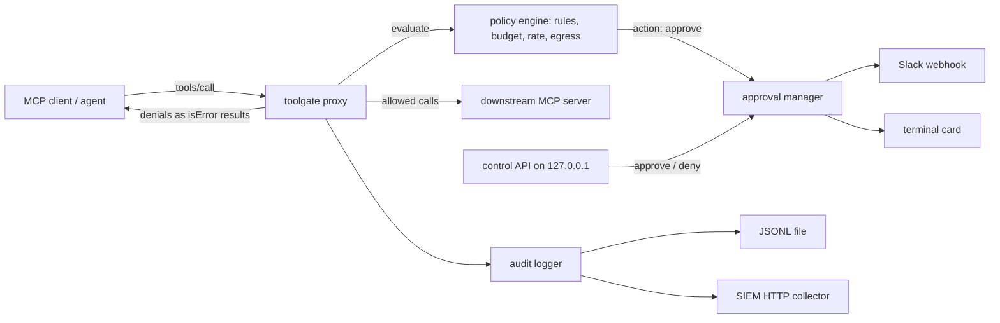

# toolgate

[English](README.md) | [中文](README.zh.md) | [日本語](README.ja.md)

[](LICENSE) [](CHANGELOG.md) [](package.json) [](tests/)

**オープンソースかつ framework-agnostic な AI agent ツール呼び出し認可ゲートウェイ。人間の承認・予算遮断・データ流出ルールを提供します。**


```bash
# Not on npm yet — build from source (see Quickstart):
cd toolgate && npm install && npm run build && npm install -g .
```

## なぜ toolgate なのか

Agent プラットフォームの多くは「agent が誰か」という認証の問題をほぼ解決しましたが、ツール呼び出し 1 回ごとに「何をしてよいか」を判定するものはほとんどありません。一方で agent は決済クレデンシャルや本番環境へのアクセス権を持ち始めており、暴走したループが 1 回で送金・顧客データベースの流出・ファイル削除を引き起こし得ます。2026 年に 500 件超のオープンソース agent プロジェクトを調査した結果でも、承認ゲートと予算遮断はほぼ全面的に欠落していました。toolgate は agent とツールサーバーの間に置く MCP proxy として、どの呼び出しに人間の承認が必要か、1 タスクでいくらまで使えるか、どのデータが外に出てよいかというポリシーを強制します。

|  | toolgate | Auth0 for AI Agents | MCP gateways (e.g. ContextForge) |
|---|---|---|---|
| 制御ポイント | per MCP tool call | token issuance / vault | routing & aggregation |
| 人間による承認フロー | yes (Slack / terminal) | no | no |
| タスク単位の予算サーキットブレーカー | yes | no | no |
| データ流出の deny / redact ルール | yes | no | no |
| Agent フレームワークへの依存 | none (MCP layer) | SDK integration | none (MCP layer) |
| セルフホストとライセンス | yes (MIT) | SaaS | yes (Apache-2.0) |

## 特徴

- **ポリシーで宣言する人間の承認** — YAML のルール 1 行で任意のツール呼び出しを保留し、Slack または別のターミナルから承認できます。タイムアウト時の挙動も設定できます。
- **予算サーキットブレーカー** — タスクごとに呼び出し回数とコストの上限を設定します。上限に達するとブレーカーが開き、そのタスクの以降の呼び出しはすべて拒否されます。
- **データ流出コントロール** — ツールの引数と結果の両方向で、AWS キー・秘密鍵・API トークン・メールアドレス・カスタム正規表現などの機密情報と PII を遮断または黒塗りにします。
- **ツール単位のレートリミット** — スライディングウィンドウ方式で、特定ツールの呼び出し過多を防ぎます。
- **フレームワーク非依存** — 制御は MCP レイヤーで行うため、agent のコードを変更せず Claude Code をはじめ任意の MCP クライアントで使えます。
- **SIEM 対応の監査ストリーム** — すべての判定が構造化 JSON イベント（JSONL ファイル・HTTP collector・stderr）として出力されます。引数はデフォルトで SHA-256 ハッシュのみ記録します。
- **policy-as-code** — バージョン管理できる YAML、パス付きでエラーを報告する `toolgate validate`、CI でのオフライン試算に使える `toolgate check` を備えています。

## クイックスタート

1. インストール。toolgate はまだ npm に公開されていません。リポジトリを clone してソースからビルドしてインストールしてください:

```bash
git clone https://github.com/JaydenCJ/toolgate.git
cd toolgate
npm install && npm run build && npm install -g .
```

> **最初のリリース後**: v0.1.0 が npm registry に公開されれば、`npm install -g @jaydencj/toolgate` の 1 行でインストールできます（npm の素の名前 `toolgate` は無関係のパッケージに取られています）。公開前はこのコマンドは必ず失敗します — 上記のソースビルドを使ってください。

2. スターターポリシーを生成します:

```bash
toolgate init
```

3. ポリシーに対して判定を試算します:

```bash
toolgate check --policy toolgate.yaml --tool send_payment --args '{"to":"acme","amount_usd":120}'
```

出力:

```text
{
  "kind": "approve",
  "rule": "approve-destructive",
  "timeoutSeconds": 300,
  "onTimeout": "deny",
  "args": {
    "to": "acme",
    "amount_usd": 120
  },
  ...
  "budget": {
    "calls_used": 1,
    "cost_used": 0.01,
    "tripped": false,
    "max_calls": 200,
    "max_cost": 5
  }
}
```

4. 任意の MCP server をラップします。Claude Code の場合は次のスニペットを `.mcp.json` に貼り付けます（直接接続と比べて変わるのは `command` の行だけです）:

```json
{
  "mcpServers": {
    "filesystem": {
      "command": "toolgate",
      "args": [
        "run", "--policy", "toolgate.yaml", "--",
        "npx", "-y", "@modelcontextprotocol/server-filesystem", "/path/you/allow"
      ]
    }
  }
}
```

5. 呼び出しが `approve` ルールに当たったら、別のターミナルから判断します:

```bash
toolgate pending
toolgate approve apr_808e4d05fed4
```

このフローの完全な実録 — ゲートウェイ起動、許可された呼び出し、拒否された呼び出し、保留された支払い、承認カード、そして最終的な監査 JSONL — は [docs/live-flow.md](docs/live-flow.md) にあります。

## ポリシーリファレンス

ポリシーは 1 つの YAML ファイルで、すべての `tools/call` を固定順で評価します。順序はサーキットブレーカー → 流出スキャン（リクエスト方向）→ レートリミット → 予算 → 最初にマッチしたアクションルール（`allow` / `deny` / `approve`）です。

```yaml
version: 1
defaults: { action: allow }
budget: { max_calls: 50, max_cost: 2.0 }   # per task (= per MCP session)
costs: { send_payment: 0.5, default: 0.01 }
rules:
  - name: block-secret-egress
    match: { tools: ["*"] }
    egress: { scan: [request], deny: [aws-access-key, private-key, api-key] }
  - name: approve-payments
    match: { tools: ["send_payment", "transfer_*"] }
    action: approve
    approval: { timeout_seconds: 120, on_timeout: deny }
  - name: redact-customer-pii
    match: { tools: ["read_customer_record"] }
    egress: { scan: [response], redact: [email] }
approvals:
  notify:
    - type: terminal
    - type: slack
      webhook_url_env: TOOLGATE_SLACK_WEBHOOK_URL
audit:
  sinks:
    - { type: jsonl, path: ./toolgate-audit.jsonl }
    - { type: http, url: "https://siem.example.com/ingest" }
```

組み込みの流出検出器は `email`、`aws-access-key`、`private-key`、`api-key`、`jwt`、`github-token`、`ipv4` で、`regex:<pattern>` によるカスタムパターンも定義できます。ルールは引数の値でもマッチできます（`match.args: { database: "^prod" }`）。コメント付きの完全な例は [examples/policy.yaml](examples/policy.yaml) を参照してください。

## デプロイ

`toolgate serve` は同じゲートウェイを Streamable HTTP エンドポイント（`POST /mcp`、`GET /health`）として公開します。デフォルトのバインド先は 127.0.0.1 です。同梱の compose ファイルはデモ MCP server と一緒に起動し、監査ストリームは named volume に保存されます:

```bash
docker compose up -d
curl http://127.0.0.1:8848/health
```

設定はすべて環境変数で行います（`.env.example` に全項目があります）。承認用の control API も 127.0.0.1 のみにバインドし、`TOOLGATE_CONTROL_TOKEN` で bearer token を設定できます。監査イベントは `toolgate-audit` volume に保存されるため、この volume をバックアップすれば判定履歴を保全できます。

## アーキテクチャ



toolgate は MCP を構造的に扱います。`tools/call` と `tools/list` 以外のメッセージはそのまま通過させるため、SDK に依存せず、プロトコルの進化にも追従しやすい設計です。拒否は `isError: true` の MCP tool result として返され、agent はセッションが切断される代わりに読める理由を受け取ります。

## ロードマップ

- [x] ポリシーエンジン：承認・予算サーキットブレーカー・レートリミット・流出ルール・監査エクスポート（stdio + Streamable HTTP の両プロキシモード）
- [ ] Slack インタラクティブ承認（webhook + CLI に代わる Socket Mode ボタン）
- [ ] YAML エンジンの代替としての OPA/Rego ポリシーバックエンド
- [ ] 承認待ちと監査検索のための Web ダッシュボード
- [ ] Agent 単位のアイデンティティと OIDC ベースのポリシー

最初のリリース後にプロジェクトが独立リポジトリへ移るまで、ロードマップは上記リストで管理します。

## コントリビューション

コントリビューションを歓迎します。開発フローは [CONTRIBUTING.md](CONTRIBUTING.md) を参照してください。issue トラッカーと Discussions は、最初のリリース後の独立リポジトリと同時に開設します。

## ライセンス

[MIT](LICENSE)
