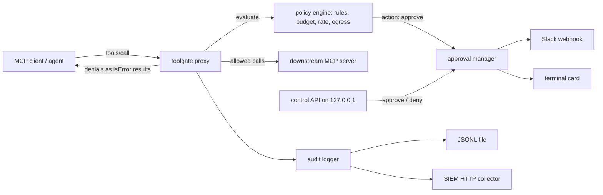

# toolgate

[English](README.md) | [中文](README.zh.md) | [日本語](README.ja.md)

[](LICENSE) [](CHANGELOG.md) [](package.json) [](tests/)

**An open-source, framework-agnostic authorization gateway for AI agent tool calls: approvals, budgets, egress rules.**


```bash
# Not on npm yet — build from source (see Quickstart):
cd toolgate && npm install && npm run build && npm install -g .
```

## Why toolgate?

Agent platforms have largely solved *who* an agent is — almost none of them decide *what it may do* on each individual tool call. Meanwhile agents are getting payment credentials and production access, so a single runaway loop can move money, leak a customer database, or delete files, and a 2026 scan of 500+ open-source agent projects found approval gates and budget breakers almost universally missing. toolgate is an MCP proxy that sits between your agent and its tool servers and enforces the policy you wrote: which calls need a human, how much a task may spend, and what data may leave.

|  | toolgate | Auth0 for AI Agents | MCP gateways (e.g. ContextForge) |
|---|---|---|---|
| Enforcement point | per MCP tool call | token issuance / vault | routing & aggregation |
| Human approval flow | yes (Slack / terminal) | no | no |
| Per-task budget circuit breaker | yes | no | no |
| Data-egress deny / redact rules | yes | no | no |
| Agent framework required | none (MCP layer) | SDK integration | none (MCP layer) |
| Self-hosted, open license | yes (MIT) | SaaS | yes (Apache-2.0) |

## Features

- **Human-in-the-loop by policy** — one YAML rule parks any tool call until a person approves it, from Slack or a second terminal, with a configurable timeout.
- **Budget circuit breaker** — cap calls and cost per task; when the ceiling is hit the breaker trips and everything else in that task is refused.
- **Egress control** — block or redact secrets and PII (AWS keys, private keys, API tokens, emails, custom regexes) in tool arguments *and* tool results.
- **Per-tool rate limits** — sliding-window limits keep noisy tools from spinning out.
- **Framework-agnostic** — enforcement happens at the MCP layer, so it works with Claude Code and any other MCP client without touching agent code.
- **SIEM-ready audit trail** — every decision becomes a structured JSON event (JSONL file, HTTP collector, or stderr); arguments are logged as SHA-256 hashes by default.
- **Policy-as-code** — versionable YAML, `toolgate validate` with precise error paths, and `toolgate check` for offline dry-runs in CI.

## Quickstart

1. Install. toolgate is not published to npm yet. Clone the repository, then build and install it from source:

```bash
git clone https://github.com/JaydenCJ/toolgate.git
cd toolgate
npm install && npm run build && npm install -g .
```

> **After the first release:** once v0.1.0 is published to the npm registry, `npm install -g @jaydencj/toolgate` becomes the one-line install (the bare name `toolgate` on npm is taken by an unrelated package). Until then the registry command fails — use the source build above.

2. Create a starter policy:

```bash
toolgate init
```

3. Dry-run a decision against it:

```bash
toolgate check --policy toolgate.yaml --tool send_payment --args '{"to":"acme","amount_usd":120}'
```

Output:

```text
{
  "kind": "approve",
  "rule": "approve-destructive",
  "timeoutSeconds": 300,
  "onTimeout": "deny",
  "args": {
    "to": "acme",
    "amount_usd": 120
  },
  ...
  "budget": {
    "calls_used": 1,
    "cost_used": 0.01,
    "tripped": false,
    "max_calls": 200,
    "max_cost": 5
  }
}
```

4. Wrap any MCP server — for Claude Code, paste this into `.mcp.json` (only the `command` line changes versus a direct connection):

```json
{
  "mcpServers": {
    "filesystem": {
      "command": "toolgate",
      "args": [
        "run", "--policy", "toolgate.yaml", "--",
        "npx", "-y", "@modelcontextprotocol/server-filesystem", "/path/you/allow"
      ]
    }
  }
}
```

5. When a call hits an `approve` rule, decide from another terminal:

```bash
toolgate pending
toolgate approve apr_808e4d05fed4
```

A full captured session of this flow — gateway startup, an allowed call, a denied call, a parked payment, the approval card, and the resulting audit JSONL — is in [docs/live-flow.md](docs/live-flow.md).

## Policy reference

A policy is one YAML file evaluated on every `tools/call`, in a fixed order: circuit breaker → egress (request) → rate limits → budget → first matching action rule (`allow` / `deny` / `approve`).

```yaml
version: 1
defaults: { action: allow }
budget: { max_calls: 50, max_cost: 2.0 }   # per task (= per MCP session)
costs: { send_payment: 0.5, default: 0.01 }
rules:
  - name: block-secret-egress
    match: { tools: ["*"] }
    egress: { scan: [request], deny: [aws-access-key, private-key, api-key] }
  - name: approve-payments
    match: { tools: ["send_payment", "transfer_*"] }
    action: approve
    approval: { timeout_seconds: 120, on_timeout: deny }
  - name: redact-customer-pii
    match: { tools: ["read_customer_record"] }
    egress: { scan: [response], redact: [email] }
approvals:
  notify:
    - type: terminal
    - type: slack
      webhook_url_env: TOOLGATE_SLACK_WEBHOOK_URL
audit:
  sinks:
    - { type: jsonl, path: ./toolgate-audit.jsonl }
    - { type: http, url: "https://siem.example.com/ingest" }
```

Built-in egress detectors: `email`, `aws-access-key`, `private-key`, `api-key`, `jwt`, `github-token`, `ipv4`, plus `regex:<pattern>` for anything custom. Rules can also match on argument values (`match.args: { database: "^prod" }`). See [examples/policy.yaml](examples/policy.yaml) for a fully commented file.

## Deployment

`toolgate serve` exposes the same gateway as a Streamable HTTP endpoint (`POST /mcp`, `GET /health`), bound to 127.0.0.1 by default. The bundled compose file runs it against the demo MCP server with a named volume for the audit trail:

```bash
docker compose up -d
curl http://127.0.0.1:8848/health
```

Configuration is environment-based (`.env.example` lists every variable). The control API for approvals also binds 127.0.0.1 and supports a bearer token via `TOOLGATE_CONTROL_TOKEN`. Audit events live in the `toolgate-audit` volume; back that volume up to retain the decision trail.

## Architecture



toolgate treats MCP structurally: everything except `tools/call` and `tools/list` passes through untouched, which is why it needs no SDK and survives protocol evolution. Denials are returned as MCP tool results with `isError: true`, so the agent reads a plain-language reason instead of crashing the session.

## Roadmap

- [x] Policy engine with approvals, budget circuit breaker, rate limits, egress rules, and audit export (stdio + Streamable HTTP proxy)
- [ ] Slack interactive approvals (Socket Mode buttons instead of webhook + CLI)
- [ ] OPA/Rego policy backend as an alternative to the YAML engine
- [ ] Web dashboard for pending approvals and audit search
- [ ] Per-agent identities and OIDC-backed policies

The roadmap is tracked in this list until the project moves to a standalone repository after the first release.

## Contributing

Contributions are welcome — see [CONTRIBUTING.md](CONTRIBUTING.md) for the development workflow. The issue tracker and Discussions open together with the standalone repository after the first release.

## License

[MIT](LICENSE)
