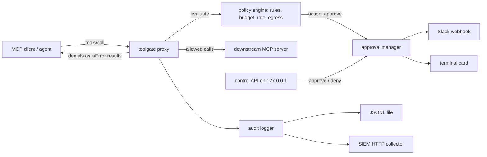

# toolgate

[English](README.md) | [中文](README.zh.md) | [日本語](README.ja.md)

[](LICENSE) [](CHANGELOG.md) [](package.json) [](tests/)

**开源、framework-agnostic 的 AI agent 工具调用授权网关：人工审批、预算熔断、数据出界规则。**


```bash
# Not on npm yet — build from source (see Quickstart):
cd toolgate && npm install && npm run build && npm install -g .
```

## 为什么是 toolgate？

Agent 平台大多解决了 agent「是谁」的问题——却几乎没有平台对每一次工具调用判定「它可以做什么」。与此同时，agent 正在拿到支付凭证与生产环境权限：一次失控的循环就可能转走资金、泄露客户数据库或删除文件；2026 年一项对 500+ 开源 agent 项目的扫描发现，审批门与预算熔断几乎普遍缺失。toolgate 是一个 MCP proxy，架在 agent 与工具服务器之间，执行你写下的策略：哪些调用需要人工审批、一个任务最多花多少、哪些数据可以出界。

|  | toolgate | Auth0 for AI Agents | MCP gateways (e.g. ContextForge) |
|---|---|---|---|
| 拦截点 | per MCP tool call | token issuance / vault | routing & aggregation |
| 人工审批流 | yes (Slack / terminal) | no | no |
| 单任务预算熔断 | yes | no | no |
| 数据出界 deny / redact 规则 | yes | no | no |
| 是否绑定 agent 框架 | none (MCP layer) | SDK integration | none (MCP layer) |
| 自托管与开源许可 | yes (MIT) | SaaS | yes (Apache-2.0) |

## 特性

- **策略化的人工介入** —— 一条 YAML 规则即可把任意工具调用挂起，等人从 Slack 或另一个终端批准，超时行为可配置。
- **预算熔断器** —— 按任务限制调用次数与成本；触顶后熔断器打开，该任务的后续调用全部拒绝。
- **数据出界控制** —— 在工具参数*和*工具结果两个方向拦截或抹除机密与 PII（AWS key、私钥、API token、邮箱、自定义正则）。
- **工具级速率限制** —— 滑动窗口限流，防止某个工具被疯狂调用。
- **框架无关** —— 在 MCP 层执行，无需改动 agent 代码即可用于 Claude Code 及任何 MCP 客户端。
- **SIEM 就绪的审计流** —— 每个决策都是一条结构化 JSON 事件（JSONL 文件、HTTP collector 或 stderr）；参数默认只记录 SHA-256 哈希。
- **策略即代码** —— 可版本化的 YAML，`toolgate validate` 给出精确到路径的报错，`toolgate check` 支持在 CI 里离线试算。

## 快速开始

1. 安装。toolgate 尚未发布到 npm。请 clone 仓库后从源码构建安装：

```bash
git clone https://github.com/JaydenCJ/toolgate.git
cd toolgate
npm install && npm run build && npm install -g .
```

> **首个 release 之后**：v0.1.0 发布到 npm registry 后，`npm install -g @jaydencj/toolgate` 即为一行安装（npm 上的裸名 `toolgate` 已被一个无关包占用）。发布之前该命令必然失败——请使用上面的源码构建方式。

2. 生成起步策略：

```bash
toolgate init
```

3. 离线试算一次决策：

```bash
toolgate check --policy toolgate.yaml --tool send_payment --args '{"to":"acme","amount_usd":120}'
```

输出：

```text
{
  "kind": "approve",
  "rule": "approve-destructive",
  "timeoutSeconds": 300,
  "onTimeout": "deny",
  "args": {
    "to": "acme",
    "amount_usd": 120
  },
  ...
  "budget": {
    "calls_used": 1,
    "cost_used": 0.01,
    "tripped": false,
    "max_calls": 200,
    "max_cost": 5
  }
}
```

4. 包裹任意 MCP server——以 Claude Code 为例，把下面片段粘进 `.mcp.json`（相比直连只改了 `command` 一行）：

```json
{
  "mcpServers": {
    "filesystem": {
      "command": "toolgate",
      "args": [
        "run", "--policy", "toolgate.yaml", "--",
        "npx", "-y", "@modelcontextprotocol/server-filesystem", "/path/you/allow"
      ]
    }
  }
}
```

5. 当调用命中 `approve` 规则时，在另一个终端做决定：

```bash
toolgate pending
toolgate approve apr_808e4d05fed4
```

这一流程的完整实录——网关启动、一次允许的调用、一次被拒绝的调用、被挂起的支付、审批卡片以及最终的审计 JSONL——见 [docs/live-flow.md](docs/live-flow.md)。

## 策略参考

策略是一个 YAML 文件，对每次 `tools/call` 按固定顺序评估：熔断器 → 出界扫描（请求方向）→ 速率限制 → 预算 → 第一条匹配的动作规则（`allow` / `deny` / `approve`）。

```yaml
version: 1
defaults: { action: allow }
budget: { max_calls: 50, max_cost: 2.0 }   # per task (= per MCP session)
costs: { send_payment: 0.5, default: 0.01 }
rules:
  - name: block-secret-egress
    match: { tools: ["*"] }
    egress: { scan: [request], deny: [aws-access-key, private-key, api-key] }
  - name: approve-payments
    match: { tools: ["send_payment", "transfer_*"] }
    action: approve
    approval: { timeout_seconds: 120, on_timeout: deny }
  - name: redact-customer-pii
    match: { tools: ["read_customer_record"] }
    egress: { scan: [response], redact: [email] }
approvals:
  notify:
    - type: terminal
    - type: slack
      webhook_url_env: TOOLGATE_SLACK_WEBHOOK_URL
audit:
  sinks:
    - { type: jsonl, path: ./toolgate-audit.jsonl }
    - { type: http, url: "https://siem.example.com/ingest" }
```

内置出界检测器：`email`、`aws-access-key`、`private-key`、`api-key`、`jwt`、`github-token`、`ipv4`，以及 `regex:<pattern>` 自定义模式。规则还可以按参数值匹配（`match.args: { database: "^prod" }`）。完整注释示例见 [examples/policy.yaml](examples/policy.yaml)。

## 部署

`toolgate serve` 把同一个网关以 Streamable HTTP 端点暴露（`POST /mcp`、`GET /health`），默认只绑定 127.0.0.1。仓库自带的 compose 文件会连同 demo MCP server 一起跑起来，审计流落在 named volume 里：

```bash
docker compose up -d
curl http://127.0.0.1:8848/health
```

配置全部走环境变量（`.env.example` 列出了每一项）。审批用的控制 API 同样只绑 127.0.0.1，并支持通过 `TOOLGATE_CONTROL_TOKEN` 设置 bearer token。审计事件保存在 `toolgate-audit` volume 中，备份该 volume 即可保留完整决策记录。

## 架构



toolgate 只按结构理解 MCP：除 `tools/call` 与 `tools/list` 外的一切消息原样透传，因此不依赖任何 SDK，也能随协议演进而存活。拒绝会以 `isError: true` 的 MCP tool result 返回，agent 读到的是一句人话，而不是被掐断的会话。

## 路线图

- [x] 策略引擎：审批、预算熔断、速率限制、出界规则、审计导出（stdio + Streamable HTTP 双模式代理）
- [ ] Slack 交互式审批（Socket Mode 按钮，替代 webhook + CLI）
- [ ] OPA/Rego 策略后端，作为 YAML 引擎的替代
- [ ] 待审批与审计检索的 Web 面板
- [ ] Per-agent 身份与基于 OIDC 的策略

在项目于首个 release 后迁往独立仓库之前，路线图以上表为准。

## 参与贡献

欢迎贡献——开发流程见 [CONTRIBUTING.md](CONTRIBUTING.md)。issue 追踪与 Discussions 将随首个 release 后的独立仓库一同开放。

## 许可证

[MIT](LICENSE)
